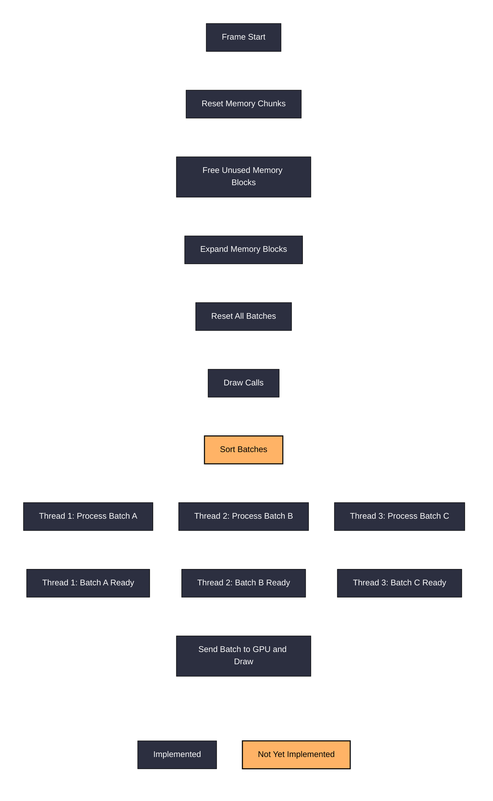
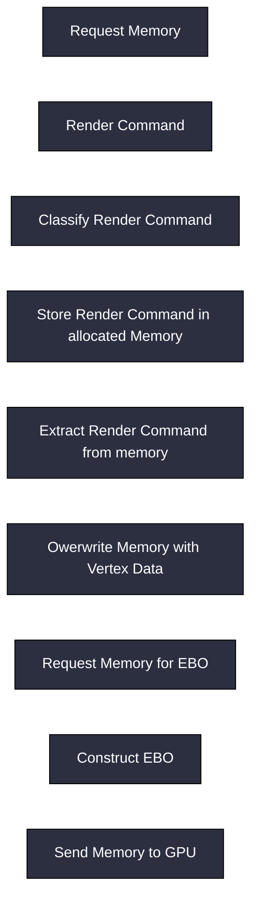
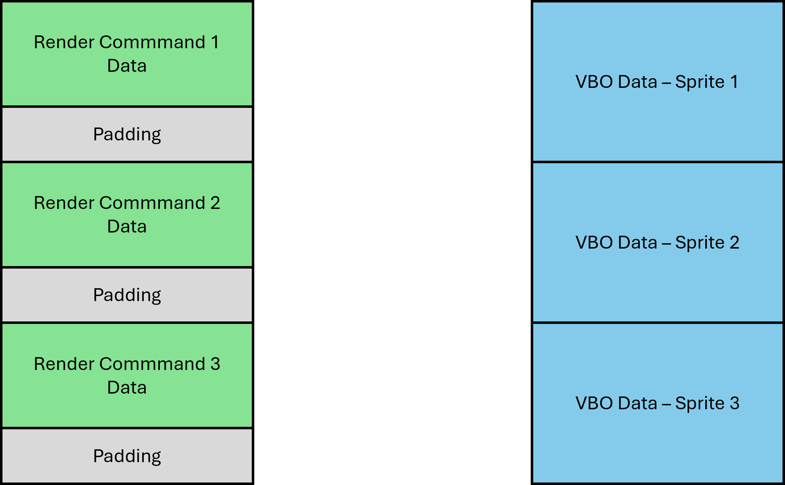
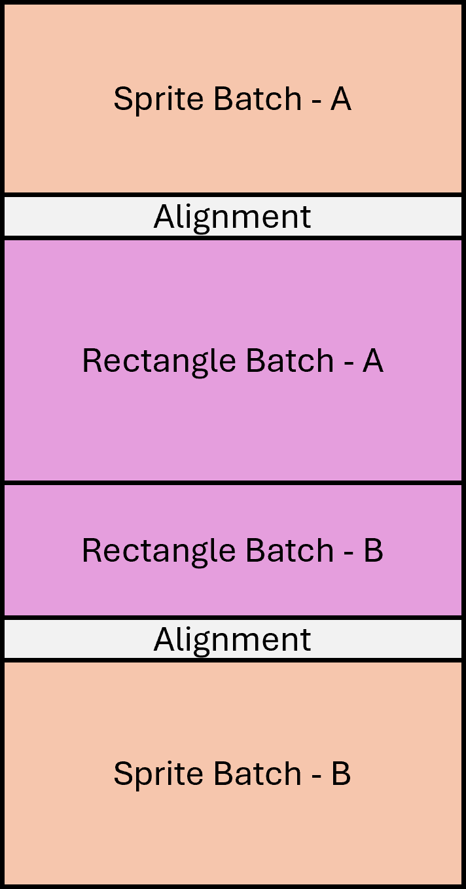
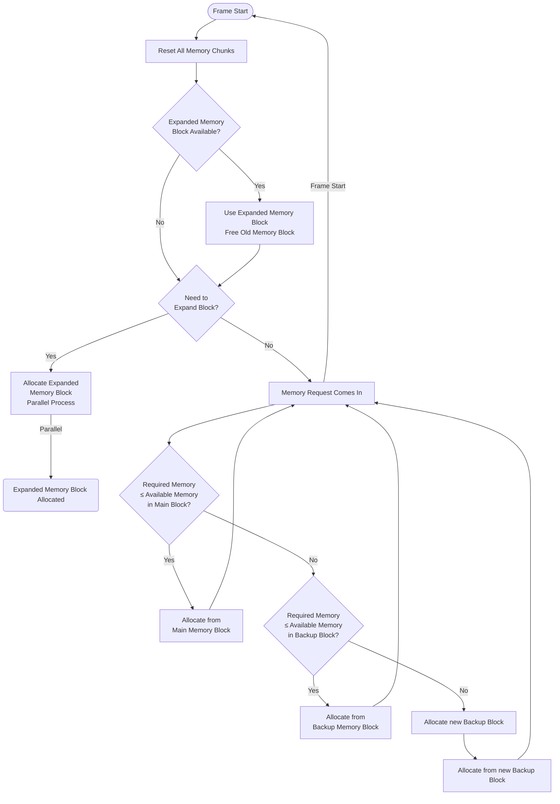

# Memory and Pipeline Documentation

## High-Level Pipeline Flow

## Batch Processing Pipeline

## Memory Chunk Layout

## Memory Block Layout

## Memory Manager Pipeline (Render Usecase)

## Thread Execution Timeline (current Target)

```mermaid
gantt
    title Pipelined Batch Rendering Timeline
    dateFormat x
    axisFormat %L
    
  section Thread 1
    Prepare Batch A    :active, t1a, 0, 50
    Prepare Batch D    :active, t1e, 55, 115
    Prepare Batch G    :active, t1i, 120, 160
    
    section Thread 2
    Prepare Batch B    :active, t2b, 5, 65
    Prepare Batch E    :active, t2f, 70, 135
    Prepare Batch H    :active, t2j, 140, 190
    
    section Thread 3
    Prepare Batch C    :active, t3c, 10, 60
    Prepare Batch F    :active, t3g, 65, 175
    Prepare Batch I    :active, t3k, 180, 215
    
    section Main Thread
    Submit A          :crit, ma, 55, 65
    Submit B          :crit, mb, 70, 85
    Submit C          :crit, mc, 90, 100
    Submit D          :crit, md, 120, 140
    Submit E          :crit, me, 145, 165
    Submit F          :crit, mf, 180, 205
    Submit G          :crit, mg, 210, 220
    Submit H          :crit, mh, 225, 235
    Submit I          :crit, mi, 240, 250
```

This workflow is currently not possible. The Main-Thread waits until all Batches are processed.