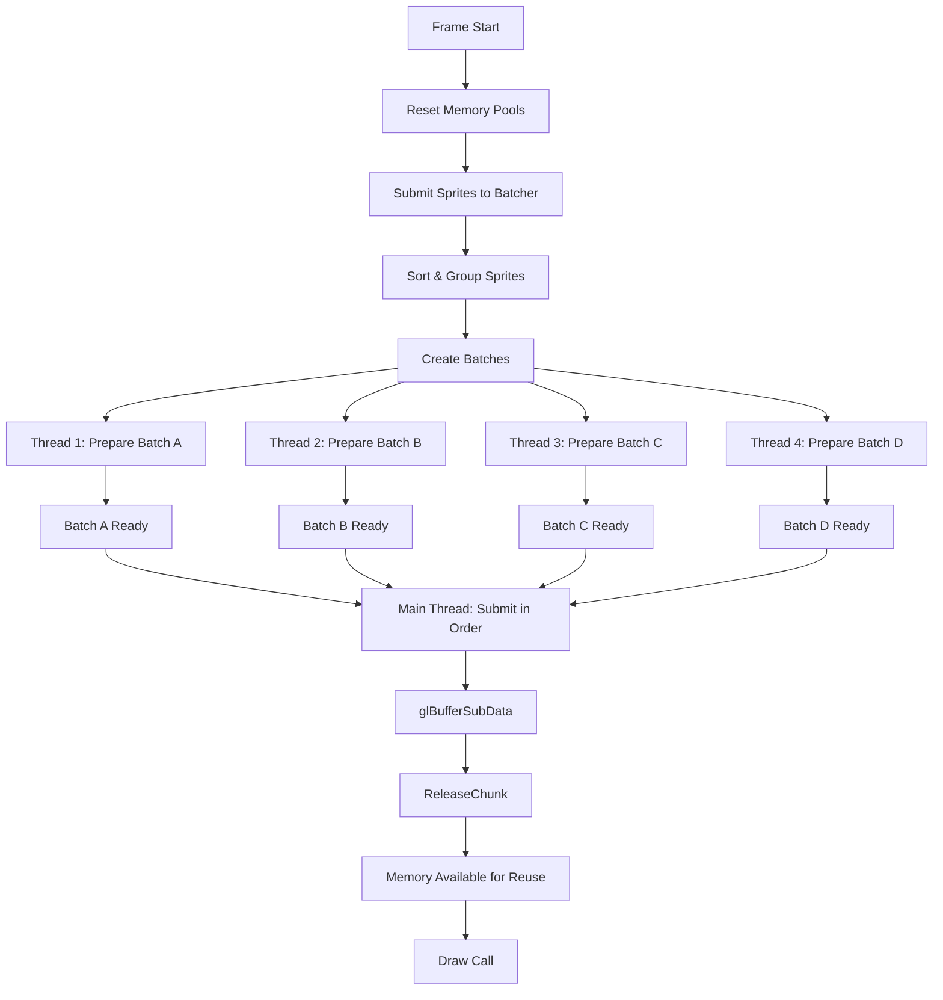
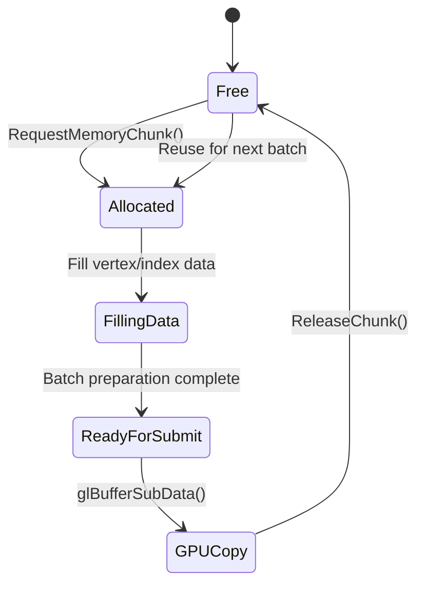
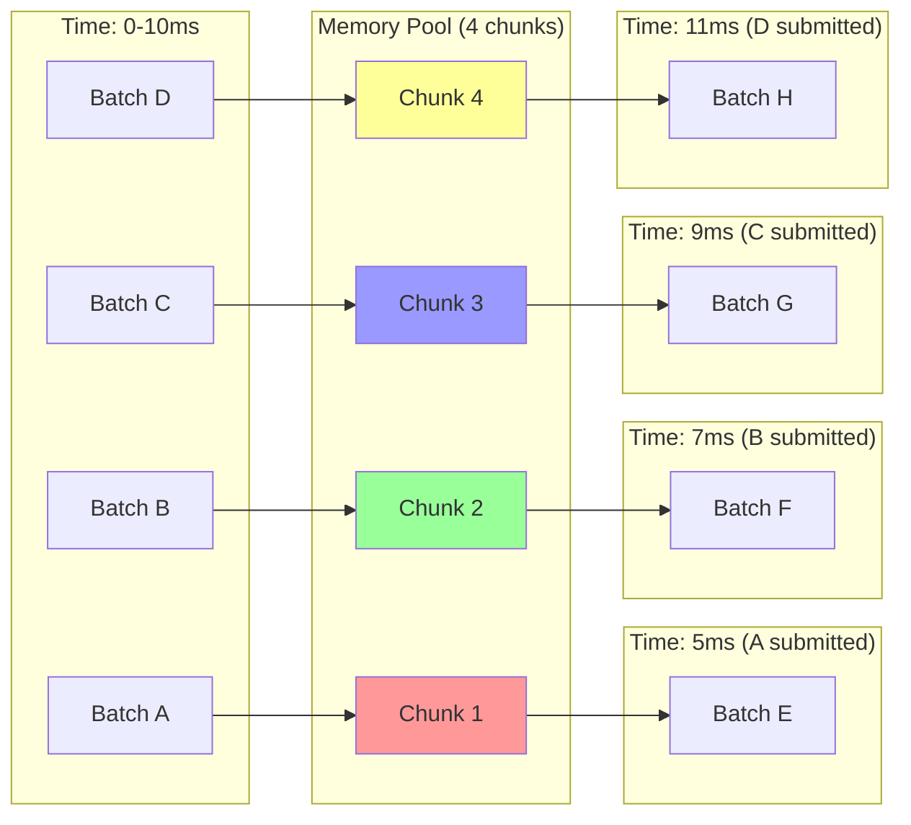
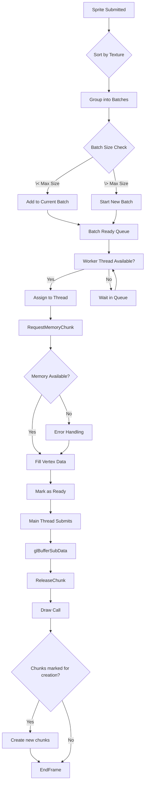
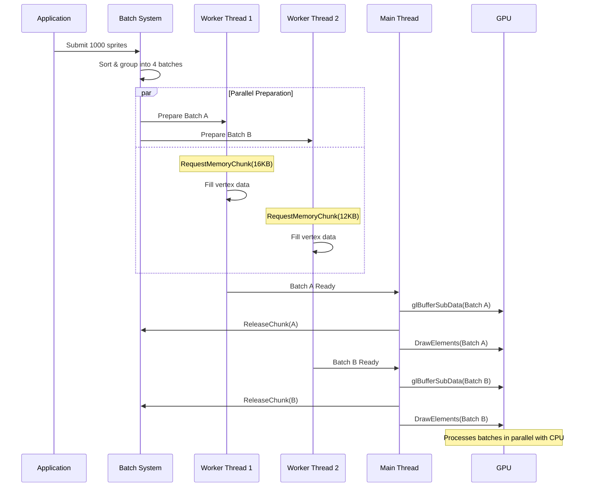
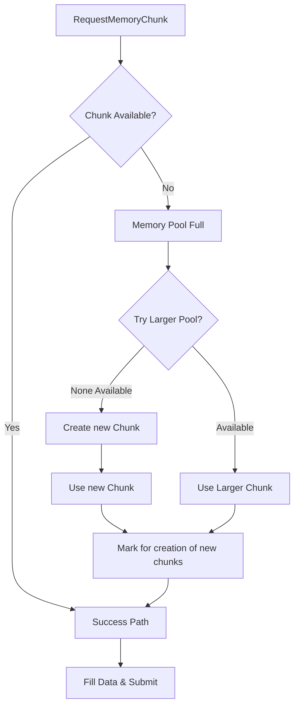

# Pipelined Rendering with Memory Reuse

## High-Level Pipeline Flow

## Memory Lifecycle State Machine

## Thread Execution Timeline

```mermaid
gantt
    title Pipelined Batch Rendering Timeline
    dateFormat X
    axisFormat %Lms
    
    section Thread 1
    Prepare Batch A    :active, t1a, 0, 5
    Prepare Batch E    :active, t1e, 10, 15
    Prepare Batch I    :active, t1i, 20, 25
    
    section Thread 2
    Prepare Batch B    :active, t2b, 2, 7
    Prepare Batch F    :active, t2f, 12, 17
    Prepare Batch J    :active, t2j, 22, 27
    
    section Thread 3
    Prepare Batch C    :active, t3c, 4, 9
    Prepare Batch G    :active, t3g, 14, 19
    Prepare Batch K    :active, t3k, 24, 29
    
    section Thread 4
    Prepare Batch D    :active, t4d, 6, 11
    Prepare Batch H    :active, t4h, 16, 21
    Prepare Batch L    :active, t4l, 26, 31
    
    section Main Thread
    Submit A          :crit, ma, 5, 6
    Submit B          :crit, mb, 7, 8
    Submit C          :crit, mc, 9, 10
    Submit D          :crit, md, 11, 12
    Submit E          :crit, me, 15, 16
    Submit F          :crit, mf, 17, 18
    
    section GPU
    Process A-D       :gpu1, 5, 12
    Process E-H       :gpu2, 15, 22
    Process I-L       :gpu3, 25, 32
```

## Memory Pool Reuse Pattern

## Batch Processing States

## Synchronization Points

## Error Handling Flow

